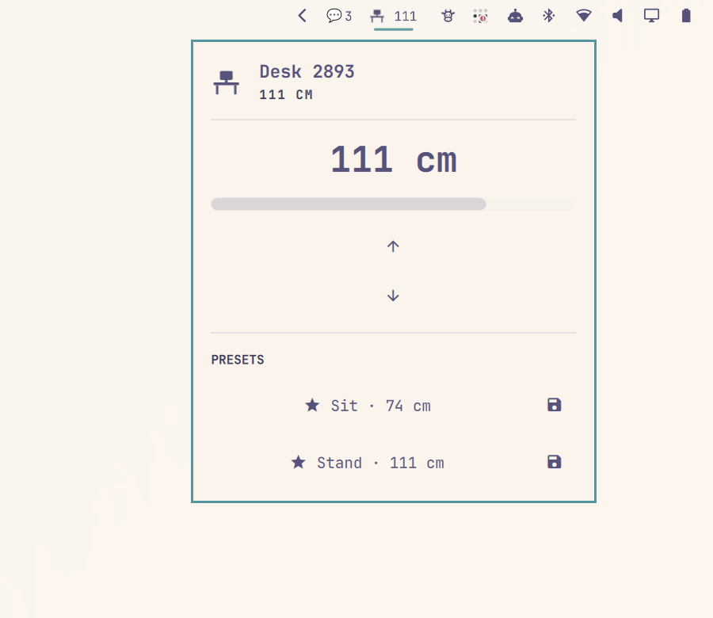

# Omadesk

Omadesk is an [Omarchy](https://omarchy.org/) shell plugin that controls LINAK
and IKEA IDÅSEN standing desks over Bluetooth Low Energy.

A desk icon sits in the bar with the current height in centimetres. Omadesk
never ships a desk address: each computer discovers *your* desk and stores it
locally.



## Requirements

- Omarchy 4 (Quickshell / `omarchy-shell`)
- A LINAK or IKEA IDÅSEN Bluetooth desk (the Bluetooth name usually starts
  with `Desk`)
- `python-bleak`: `omarchy pkg add python-bleak`

Keep the area under and above the desk clear while it is moving. Only one
app should talk to the desk at a time — quit Desk Remote Control, the IKEA
Home smart app, or any other BLE desk controller before using Omadesk.

## Install and use your desk

### 1. Install the BLE library and the plugin

```sh
omarchy pkg add python-bleak
omarchy plugin add https://github.com/zekus/omadesk.git --enable
```

Omarchy clones the repo into `~/.config/omarchy/plugins/omadesk/`.
Plugins run as unsandboxed code inside `omarchy-shell`; read the files there
if you want to review them before enabling.

If the widget is not already on the bar:

```sh
omarchy bar put omadesk --section right
```

You can also add it from **Setup → Bar**. The icon is dimmed until a desk is
connected.

### 2. Pair the desk in Bluetooth

Omadesk can only see desks the system already knows.

1. Wake the desk (press a button on the under-desk controller if it sleeps).
2. Open Omarchy’s Bluetooth panel from the bar (or **Setup → Bluetooth**).
3. Scan and pair the device named like `Desk 2893` (the number is unique to
   that frame).
4. Disconnect any phone, Mac, or other computer that is still holding the
   BLE connection. The desk accepts one client at a time.

### 3. Connect Omadesk to *your* desk

Click the Omadesk icon on the bar.

- **One paired LINAK / IDÅSEN desk nearby** — it is selected automatically
  and the height appears in the bar.
- **Several desks, or none yet** — use **Scan for desks** in the panel and
  click yours. The chosen address is saved only on this machine.

From a terminal:

```sh
omarchy-shell omadesk scan
omarchy-shell omadesk select AA:BB:CC:DD:EE:FF
omarchy-shell omadesk status
```

Replace the address with the `mac` printed by `scan`. You should not need
this if the panel picker works.

### 4. Save sit and stand heights

Factory presets (73 cm sit / 110 cm stand) are only starting points. Your
range and preferred heights will differ.

1. Hold the **top** arrow to raise, or the **bottom** arrow to lower; release
   to stop.
2. When the height feels right for sitting, tap the save icon on **Sit**.
3. Repeat for **Stand**.

Those numbers are stored in `~/.config/omarchy/omadesk/config.json` on this
computer only. After that, **Sit** and **Stand** move to your saved heights.

### 5. Daily use

- **Left-click** the bar icon — open the control panel
- **Hold the top arrow** — raise; release to stop
- **Hold the bottom arrow** — lower; release to stop
- **Sit / Stand** — move to a saved height
- **Scan for desks** — pick a different desk on this computer

To hide centimetres on the bar, or change how often height is refreshed,
use **Setup → Bar** widget settings for Omadesk, or:

```sh
omarchy bar set omadesk showHeightInBar false
omarchy bar set omadesk pollIntervalSec 2
```

## Update

```sh
omarchy plugin update omadesk
```

Omarchy shows the diff and fast-forwards the git checkout. Local sit/stand
presets and the saved desk address are not in that repo, so they are left
alone.

## Remove

```sh
omarchy plugin remove omadesk
```

Sit/stand presets in `~/.config/omarchy/omadesk/` are left in place so a
reinstall keeps them. Delete that folder if you want a clean slate.

## If it does not connect

- Confirm `python-bleak` is installed: `omarchy pkg add python-bleak`.
- Pair the desk in Bluetooth *before* opening Omadesk. A device that was
  never paired will not show up in the scan.
- Make sure nothing else is connected to the desk (phone, Mac app, another
  Linux session). Disconnect it there, then **Scan for desks** again.
- Wake the desk from the physical controller; many frames stop advertising
  after they sit idle.
- Restart the shell after install if the icon never appears:
  `omarchy restart shell`.
- The saved address lives in `~/.config/omarchy/omadesk/config.json`. Delete
  that file (or clear `"mac"`) and scan again to forget a desk on this
  machine.

## Configuration

Per-user state lives in `~/.config/omarchy/omadesk/config.json` (not in the
plugin repo). After a successful connect it looks like this:

```json
{
  "mac": "AA:BB:CC:DD:EE:FF",
  "name": "Desk",
  "presets": {
    "sit": 73,
    "stand": 110
  },
  "pollIntervalSec": 2
}
```

Edit that file only if you already know the Bluetooth address. Otherwise use
**Scan for desks** in the panel.

## IPC

```sh
omarchy-shell omadesk status
omarchy-shell omadesk toggle
omarchy-shell omadesk up
omarchy-shell omadesk down
omarchy-shell omadesk stop
omarchy-shell omadesk scan
omarchy-shell omadesk select AA:BB:CC:DD:EE:FF
omarchy-shell omadesk goto sit
```

## Development checkout

```sh
omarchy plugin validate "$PWD"
ln -sfn "$PWD" ~/.config/omarchy/plugins/omadesk
omarchy-shell shell rescanPlugins
omarchy plugin enable omadesk
```

Quickshell's file watcher does not follow symlinks; after edits run
`omarchy restart shell`.

## Protocol

The desk speaks the public LINAK / IDÅSEN GATT protocol (the same family used
by IKEA IDÅSEN and the Mac “Desk Remote Control” app):

| Characteristic | UUID | Purpose |
|----------------|------|---------|
| Command | `99fa0002-338a-1024-8a49-009c0215f78a` | Wake, up, down, stop |
| Height | `99fa0021-338a-1024-8a49-009c0215f78a` | Height and speed notifications |
| Target | `99fa0031-338a-1024-8a49-009c0215f78a` | Move-to-height |
| DPG | `99fa0011-338a-1024-8a49-009c0215f78a` | Wake handshake |

Height is encoded as tenths of a millimetre above a 62 cm base. A BLE helper
(`omadesk-daemon.py`) keeps one connection and talks to the widget over a Unix
socket at `~/.local/state/omarchy/omadesk.sock`.

## License

MIT
